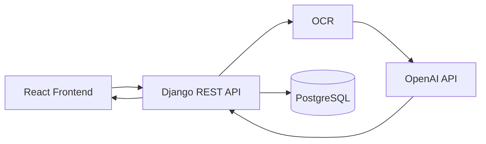

(logo)
# Shotudy-backend
AI 기반 언어 학습 서비스, Shotudy의 백엔드 레포지토리입니다.  
🏆 제14회 육군 창업경진대회 창의상 수상 
🏆 2026 pre-국방 Start-up 챌린지 최우수상 수상 

## 프로젝트 소개
Shotudy는 OCR과 LLM을 활용하여 스크린샷으로부터
단어장과 학습 콘텐츠를 자동 생성하는 AI 기반 언어 학습 서비스입니다. 

## DEMO
(gifs) 

## Tech Stack
| 분야 | 기술 |
|:----|:------|
| **Language** | `Python` |
| **Framework** | `Django` `Django REST Framework` |
| **Database** | `PostgreSQL` |
| **AI** | `OpenAI API(ChatGPT 4o mini)` |
| **Infrastructure** | `Docker` `AWS EC2` `Nginx` |
| **CI/CD** | `GitHub Actions` |
| **Tools** | `Git` `GitHub` `Notion` | 

## Architecture

 

## 주요 기능
- 🔍 **OCR** : 사용자가 업로드한 이미지에서 텍스트 추출
- 🤖 **AI 콘텐츠 생성** : LLM을 활용한 학습 콘텐츠 생성
- 📚 **단어장 자동 생성** : 단어 및 표현 자동 저장
- 👤 **Google OAuth 로그인** : Google 계정으로 간편 로그인 
